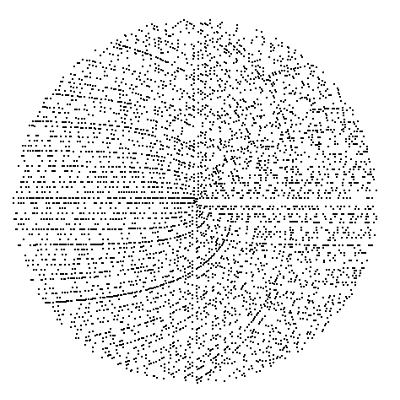

\docpart{Tutoriel : Champ des possibles}

# Giga-partie
## Partie
### Sous-partie
#### Micro-Partie

\shortcutLemme{} : Le mot *lemme* vient du grec \grec{λῆμμα}\footnote{Il désignait la majeure du syllogisme}.

On parle de *limite* seulement en l'**infini**.

Selon Michelle elle-même :
$$
	\mathrm{Li}(x) = \int_0^x \frac{dt}{ \ln t}
$$

Michelle a aussi été amenée à définir la fonction exponentielle comme $x \mapsto \sum_{n \geq 1} \frac{x^n}{n !}$. On observe ci-dessous la courbe représentative d'une variante de cette fonction :

\begin{figure}[H] \center \includegraphics{plots/plot1.tex} \end{figure}

En effet comme disait Confiture :

\begin{boitecitation}[shadeGreen]\tikz[overlay]{\node at (-0.7,0.1) {\emoji{puzzle-piece}}}Ce théorème a donné naissance aux méthodes assistées de fabrication de puzzles que l'on trouve de nos jours en magasin.\end{boitecitation}

\begin{boitecitation}[shadeRed]\tikz[overlay]{\node at (-0.7,0.1) {\emoji{police-car-light}}}Ce résultat est un incontournable du cours.\end{boitecitation}

\begin{boitecitation}[shadeBlue]\tikz[overlay]{\node at (-0.7,0.1) {\emoji{euro-banknote}}}Le modèle Black-Scholes est un modèle mathématique du marché pour une action, dans lequel le prix de l'action est un processus stochastique en temps continu. Il permet de se faire un maximum de [moula](https://fr.wiktionary.org/wiki/moulaga).\end{boitecitation}

Selon Kasparov les frites demandent comme ingrédients :

* Patates,
* Huile,
* Sel.

Il faudrait les cuisiner dans l'ordre suivant :

1. Découper les patates.
2. Les plonger dans l'huile de friture bouillante.
3. Les sortir, les saler.

Il suffirait de manière équivalente d'enter : `run fries.sh` sur son Mac personnel et des frites sortiraient de ports USB.

\shortcutDefinition{} : Un nombre premier est un entier naturel supérieur ou égal à deux et divisible par $1$ et lui-même.

\shortcutPropriete{} : Tout nombre entier $n>1$ admet un diviseur premier.

\shortcutProprietes{} : Les nombres premiers en ont pleins.

\shortcutTheoreme{} : Tout nombre entier admet une unique décomposition (à permutation près) en produit de facteurs premiers.

\shortcutCorollaire{} : Plein de formules.

\shortcutMethode{} : Extraire les facteurs premiers.

\shortcutExemple{} : $30 = 3 \cdot 10 = 3 \cdot 5 \cdot 2$.